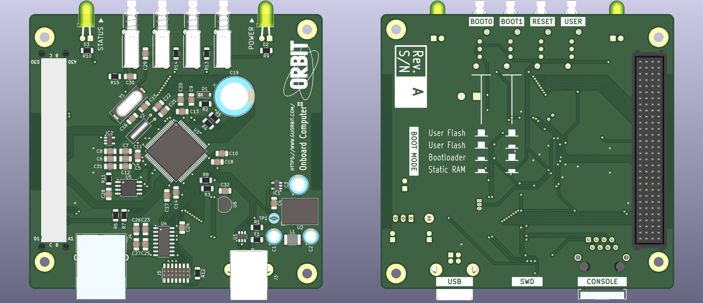

# STM32-based Onboard Computer

This repository contains the KiCad project files and fabrication outputs of GU Orbit's new generation STM32F4-based OBC board.

Revision A of this board will fly on the CloudView-2 high altitude balloon mission. This revision is an 100% COTS design with no space grade parts.

## Documentation

### User Manual

Available [HERE](https://gla.sharepoint.com/:w:/s/GUorbit/EWbB4_OCiA1IiK20_8yILmEBxFCxNbRzXe-6b-aP8d8sqQ?e=ERlZXE) (University of Glasgow login required)

### Schematic Diagram
Available [HERE](https://gla.sharepoint.com/:b:/s/GUorbit/EcqzIoVTQb1NrapEKPAgqEgBkPuZpGcCXpksztv5thLR0g?e=U3XVNj) (University of Glasgow login required)

### Mechanical Drawing
Available [HERE](https://gla.sharepoint.com/:b:/s/GUorbit/EUr8ayuSMrpKpmlO9UEF-kwB01D8GUk2koGHjnPf7s4Tdw?e=q49YmD) (University of Glasgow login required)

### 3D Model for CAD
Available under the [CAD](/CAD) directory in STEP and FreeCAD formats